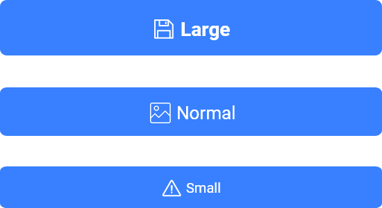

# Bot&oacute;n con &iacute;cono


## Bot&oacute;n con &iacute;cono

El atributo **shape** est&aacute; definido por defecto como `GFButtonShape.standard`, por lo tanto, obtendremos un bot&oacute;n est&aacute;ndar con un s&oacute;lido color de fondo y bordes ligeramente redondeados.

### Bot&oacute;n deshabilitado


El atributo **onPressed** de un GFIconButton es null por defecto, de esta forma obtenemos un bot&oacute;n deshabilitado.

```dart
import 'package:getflutter/getflutter.dart';

GFIconButton(                          
    onPressed: null,             
    text:"primary"
),
```

Se pueden utilizar muchos atributos para darle estilo a los botones GFIconButton y que luzcan de una manera espec&iacute;fica. Cada uno de los atributos se describe a continuaci&oacute;n.

### Bot&oacute;n s&oacute;lido con &iacute;cono


El atributo **type** est&aacute; definido por defecto como `GFButtonType.solid`, por lo tanto, obtendremos un bot&oacute;n con un s&oacute;lido color de fondo y bordes ligeramente redondeados.

El callback disparado cuando se presiona el bot&oacute;n, definido en el atributo **onPressed**, habilita el bot&oacute;n.

```dart
import 'package:getflutter/getflutter.dart';

  GFButton(
    onPressed: (){},
    text: "primary",
    icon: Icon(Icons.share),
  ),
```

### Bot&oacute;n Outline con &iacute;cono


Outline Icon Button es un bot&oacute;n con fondo transparente y borde visible. Podemos obtener este bot&oacute;n facilmente definiedo el atributo **type** como **`GFButtonType.outline`**.

```dart
import 'package:getflutter/getflutter.dart';

GFButton(
    onPressed: (){},
    text: "primary",
    icon: Icon(Icons.share),
    type: GFButtonType.outline,
 ),
```

### Bot&oacute;n Outline 2x con &iacute;cono


Outline 2x Icon Button es un bot&oacute;n con fondo transparente y borde visible con un ancho de 2x. Podemos obtener este bot&oacute;n facilmente definiedo el atributo **type** como **`GFButtonType.outline2x`**.

```dart
import 'package:getflutter/getflutter.dart';

GFButton(
    onPressed: (){},
    text: "primary",
    icon: Icon(Icons.share),
    type: GFButtonType.outline2x,
 ),
```

### Bot&oacute;n transparente con &iacute;cono


En un GFIconButton, definiendo la propiedad **type** como **`GFButtonType.transparent`** obtenemos un bot&oacute;n transparente. Por defecto, el valor de **type** es **`GFButtonType.solid`**.

```dart
import 'package:getflutter/getflutter.dart';

GFButton(
    onPressed: (){},
    text: "primary",
    icon: Icon(Icons.share),
    type: GFButtonType.transparent,
 ),
```

### Bot&oacute;n p&iacute;ldora con &iacute;cono


Podemos obtener un bot&oacute;n con forma de p&iacute;ldora y un color s&oacute;lido de fondo con bordes redondeados definiedo la propiedad **shape** como **`GFButtonShape.pills`**.

```dart
import 'package:getflutter/getflutter.dart';

  GFButton(
    onPressed: (){},
    text: "primary",
    icon: Icon(Icons.share),
    shape: GFButtonShape.pills,
  ),
```

### Bot&oacute;n cuadrado con &iacute;cono


Podemos obtener un bot&oacute;n cuadrado con un color s&oacute;lido de fondo y sin bordes redondeados definiedo la propiedad **shape** como **`GFButtonShape.square`**.

```dart
import 'package:getflutter/getflutter.dart';

  GFButton(
    onPressed: (){},
    text: "primary",
    icon: Icon(Icons.share),
    shape: GFButtonShape.square,
  ),
```

### Bot&oacute;n bloque con &iacute;cono



Block Button especifica cuan ancho debe ser el bot&oacute;n. Definiendo **blockButton** como `true`, el bot&oacute;n ser&aacute; un bloque de ancho m&aacute;ximo con bordes redondeados. Por defecto **blockButton** est&aacute; definido como `false`.

```dart
import 'package:getflutter/getflutter.dart';

GFButton(
    onPressed: (){},
    text: "primary",
    icon: Icon(Icons.share),
    type: GFButtonType.solid,
    blockButton: true,
 ),
```

### Bot&oacute;n de ancho m&aacute;ximo con &iacute;cono


Full Width Button especifica cuan ancho debe ser el bot&oacute;n. Definiendo **fullWidthButton** como `true`, el bot&oacute;n ser&aacute; un bot&oacute;n de ancho m&aacute;ximo con bordes redondeados y sin margen a los costados. Por defecto **fullWidthButton** est&aacute; definido como `false`.

```dart
import 'package:getflutter/getflutter.dart';

GFButton(
    onPressed: (){},
    text: "primary",
    icon: Icon(Icons.share),
    type: GFButtonType.solid,
    fullWidthButton: true,
 ),
```

### Tama&ntilde;o del bot&oacute;n con &iacute;cono

El tama&ntilde;o del bot&oacute;n puede ser modificado utilizando la propiedad **size**. El valor por defecto es `GFSize.MEDIUM`.

```dart
import 'package:getflutter/getflutter.dart';

GFButton(
    onPressed: (){},
    text: "primary",
    icon: Icon(Icons.share),
    size: GFSize.SMALL,
 ),
```

## Botones solo con &iacute;conos

Los botones solo con &iacute;conos tienen la funcionalidad est&aacute;ndar de un bot&oacute;n s&oacute;lido, y tienen un &iacute;cono como hijo.

El atributo **shape** est&aacute; definido por defecto como `GFButtonShape.standard`, por lo tanto, obtendremos un bot&oacute;n con forma est&aacute;ndar con un s&oacute;lido color de fondo y bordes ligeramente redondeados. El atributo **type** est&aacute; definido por defecto como `GFButtonType.solid`, por lo tanto, obtendremos un bot&oacute;n con un s&oacute;lido color de fondo y bordes ligeramente redondeados.

```dart
import 'package:getflutter/getflutter.dart';

GFIconButton(
    onPressed: (){},
    icon: Icon(Icons.share),
 ),
```

### Tama&ntilde;o

El tama&ntilde;o del bot&oacute;n puede ser modificado utilizando la propiedad **size**. El valor por defecto es `GFSize.MEDIUM`.

```dart
import 'package:getflutter/getflutter.dart';

GFIconButton(
    onPressed: (){},
    text: "primary",
    size: GFSize.SMALL,
 ),
```

### Tipo

El tipo del bot&oacute;n puede ser cambiado definiedo la propiedad **type** como `GFButtonType.outline`. El valor por defecto es `GFButtonType.solid`.

```dart
import 'package:getflutter/getflutter.dart';

GFIconButton(
    onPressed: (){},
    text: "primary",
    type: GFButtonType.outline,
 ),
```

### Forma

La forma del bot&oacute;n puede ser cambiada definiendo la propiedad **shape** to `GFIconButtonShape.circle`. El valor por defecto es `GFIconButtonShape.standard`, con lo cual obtenemos un bot&oacute;n cuadrado con los bordes ligeramente redondeados.

```dart
import 'package:getflutter/getflutter.dart';

GFIconButton(
    onPressed: (){},
    text: "primary",
    shape: GFIconButtonShape.pills,
 ),
```

|  |  |
| :--- | :--- |
| **Descripci&oacute;n** | La forma del bot&oacute;n |
| **Atributo** | shape |
| **Tipo** | `GFIconButtonShape.standard, GFIconButtonShape.square, GFIconButtonShape.pills, GFIconButtonShape.circle` |
| **Default** | `GFIconButtonShape.standard` |

### Propiedades personalizadas

| Nombre | Descripci&oacute;n |
| :--- | :--- |
| **child** | hijo del tipo \[widget\] alternativa a la propiedad text |
| **textColor** | el color a usar para el texto de esta insignia |
| **textStyle** | define el estilo del texto |
| **borderSide** | define el borde del bot&oacute;n  |
| **borderShape** | define la forma del borde |
| **color** | GFColor se usa para cambiar el fondo del bot&oacute;n |
| **iconSize** | define el tama&ntilde;o del &iacute;cono |
| **buttonBoxShadow** | si es `true` muestra el sombreado por defecto del bot&oacute;n |
| **boxShadow** | define el sombreado del bot&oacute;n |
