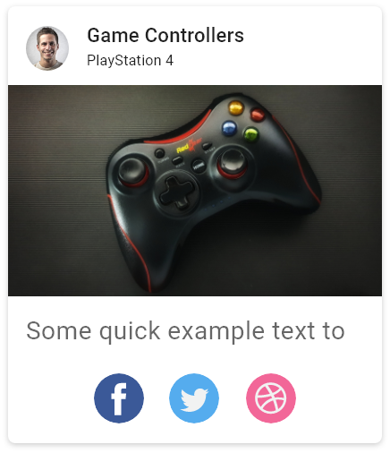

# GF Card


### Usage

Below code gives the basic GFCard

```dart
import 'package:getflutter/components/card/gf_card.dart';
import 'package:getflutter/components/button/gf_button_bar.dart';
import 'package:getflutter/components/list_tile/gf_list_tile.dart';
import 'package:getflutter/components/avatar/gf_avatar.dart';
  
  GFCard(
    boxFit: BoxFit.cover,
    image: Image.asset('your asset image'),
    title: GFListTile(
        title: Text('Card Title'),
        icon: GFIconButton(
            onPressed: null,
            icon: Icon(Icons.favorite_border),
            type: GFType.transparent,
        )
    ),
    content: Text("Some quick example text to build on the card"),
    buttonBar: GFButtonBar(
      alignment: MainAxisAlignment.start,
      children: <Widget>[
        GFButton(
          onPressed: () {},
          text: 'Read More',
        ),
     ],
   ),
 ),
```

### GFCards with Avatar



```dart
import 'package:getflutter/components/card/gf_card.dart';
import 'package:getflutter/components/button/gf_button_bar.dart';
import 'package:getflutter/components/list_tile/gf_list_tile.dart';
import 'package:getflutter/components/avatar/gf_avatar.dart';
  
  GFCard(
    boxFit: BoxFit.cover,
    image: Image.asset('your asset image'),
    title: GFListTile(
        avatar:GFAvatar(),
        title: Text('Card Title'),
        icon: GFIconButton(
            onPressed: null,
            icon: Icon(Icons.favorite_border),
            type: GFType.transparent,
         )
     ),
     content:Text( "Some quick example text to build on the card"),
     buttonBar: GFButtonBar(
     alignment: MainAxisAlignment.start,
      children: <Widget>[
        GFButton(
          onPressed: () {},
          text: 'Read More',
         ),
       ],
     ),
   ),
```

### GFCards with OverlayImage


```dart
import 'package:getflutter/components/card/gf_card.dart';
import 'package:getflutter/components/button/gf_button_bar.dart';
import 'package:getflutter/components/list_tile/gf_list_tile.dart';
import 'package:getflutter/components/avatar/gf_avatar.dart';
  
  GFCard(
    boxFit: BoxFit.cover,
    imageOverlay: AssetImage('your asset image'),
    title: GFListTile(
       avatar: GFAvatar(),
       title: Text('Card Title'),
       subTitle: Text('subtitle'),
     ),
     content: Text("GFCards has three types of cards i.e, basic, with avataras and with overlay image")
     buttonBar: GFButtonBar(
     alignment: MainAxisAlignment.center,
     children: <Widget>[
     GFButton(
       onPressed: () {},
       text: 'View',
       )
      ],
     ),
   ),
```

### Custom Properties

|  |  |
| :--- | :--- |
| **titlePosition** | helps to set the title at  top of the card |
| **color** | sets the background color of the card |
| **elevation** | controls the size of the shadow below the card |
| **shape** | shape of the card |
| **borderOnForeground** | whether to paint the shape of the border in front of the child, defaults to true |
| **clipBehaviour** | defines the clipping of the child |
| **margin** | defines the card's outer container margin |
| **padding** | defines the card's outer container padding |
| **semanticContainer** | represents a single semantic container, if false a collection of semantic nodes |
| **border** | to draw border above the card |
| **borderRadius** | represents the rounded corners of the card |
| **colorFilter** | applies to the image before painting it |
| **boxFit** | how the image should be inscribed into the box |
| **imageOverlay** | display images as background with shaded overlay |

